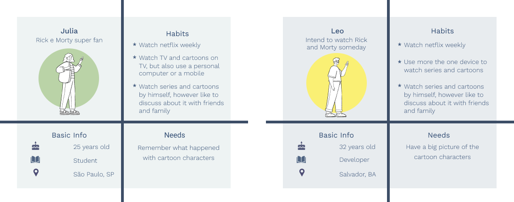
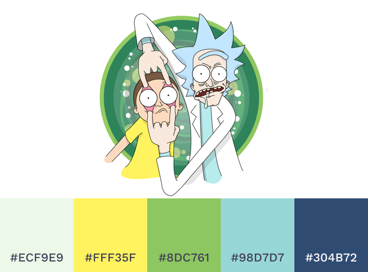
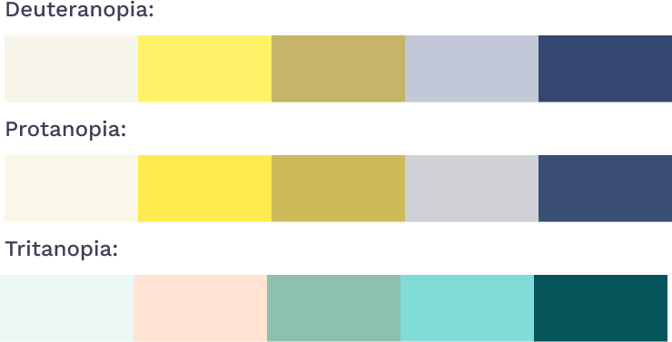
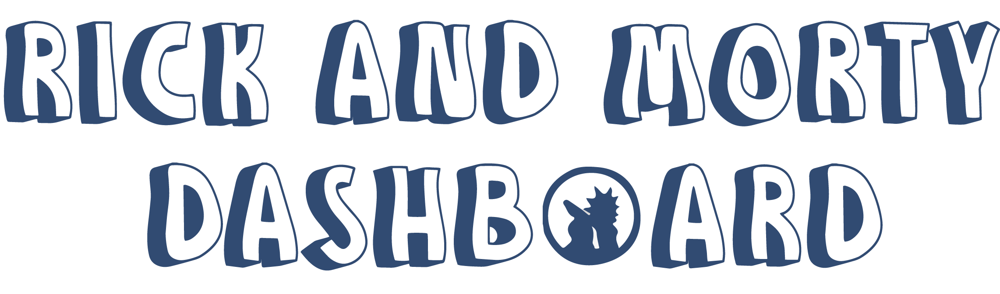
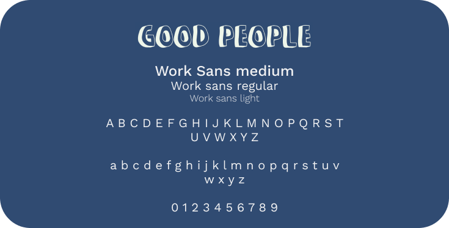
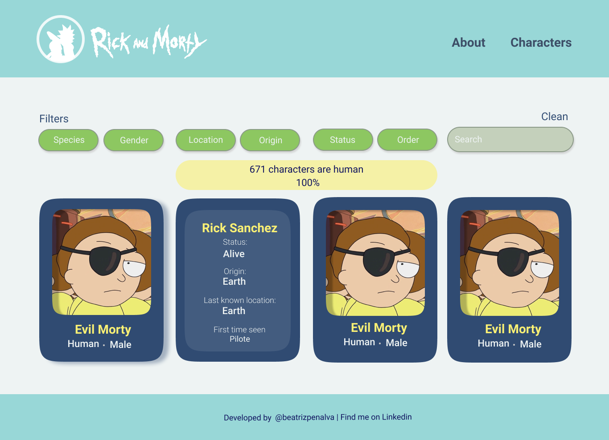
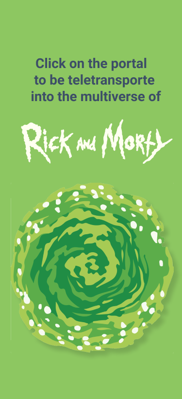
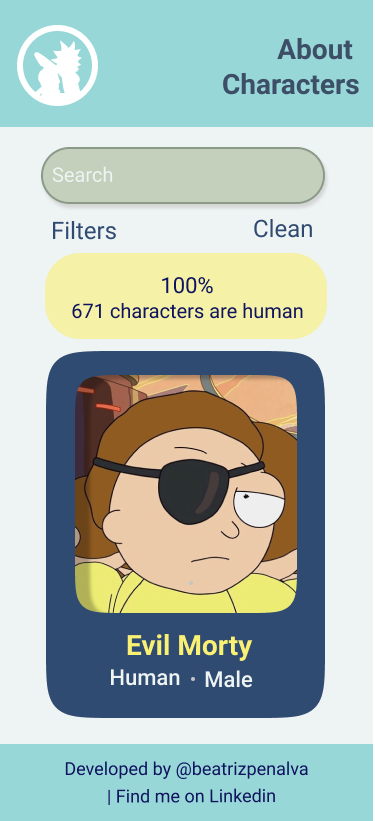

<h1 align="center" id="top"> 👴🛸👦 Rick and Morty Dashboard </h1>

<p align="center">
  An app for fans and curious to venture through a dashboard about Ricky and Morty. 
  <br>
  ⚡ To access click <a href='https://beatrizpenalva.github.io/rick-and-morty-dashboard/'>here</a>! ⚡  
</p>

<p align="center">
 <a href="#-challenge">Challenge</a> •
 <a href="#-about">About</a> •
 <a href="#-development">Development</a> • 
 <a href="#-getting-started">Getting Started</a> • 
 <a href="#-build-with">Build With</a> • 
 <a href="#-author">Author</a>
</p>

---

## 🎯 Challenge

The main goal was to develop a web app that allows the user to visualize, filter and sort data about the cartoon Rick and Morty. Besides that, it was necessary to make calculus with the data, as medium values, maximum and minimum values, etc. 

The project was developed in three weeks, using only vanilla JavaScript, HTML5 and CSS3. Also for this project, one of the acceptance criteria was to develop unit testes with minimum coverage of 70% of statements, functions, lines and branches of the src/data.js file. 

<p align="center">
  </img>
</p>

<p align="right">
  <a href="#top"> Back to the top. </a>
</p>

---

## 💡 About

Rick and Morty is a cartoon about the ventures through crazy time-space travels and parallel universes starring Rick Sanchez,  a brilliant scientist, and his (not so smart) grandson, Morty Smith. (Netflix)

The show has 4 seasons, 41 episodes and 671 characters until now. Besides the countless characters, they live in different places, are from multiple universes, from several species and some of them are dead (this is not a spoiler). So, that is a lot of data to assimilate and the time distance between the seasons makes it harder to remember. That said, this Dashboard was made to help fans to get information about people and not humans of Rick and Morty’s multiverse. 

<p align="right">
  <a href="#top"> Back to the top. </a>
</p>

---

## 💻 Development

### ✍ User experience

We use part of the [Desing Sprint](https://www.youtube.com/watch?v=aWQUSiOZ0x8&feature=emb_title) method to develop the product, we imagine our proto personas and made the validation by applying a _questionnaire_, then set our user stories, the definition of done, and acceptance criteria.

#### Protopersonas

<p align="center">
  </img>
</p>

#### User stories 

📌 User story 01: *"As a user, I want to see all characters in one page".*
  - [x] User can see all the cartoon cards on the main page
  - [x] User can flip the card to get more information about the character
  - [x] User can access the developer's repositories
  - [x] User can access the app by mobile with a responsive design

📌 User story 02: *"As a user, I want to order the cartoon cards so I can see them in alphabetic order".*
  - [x] User can see all the cartoon cards on the main page
  - [x] User can choose if he/she wants to order the characters in alphabetic order or the other way around

📌 User story 03: *"As a user, I want to filter the characters by a specific aspect (gender or status or species) so I can see all the characters that share this same aspect".*
  - [x] User can choose if he/she wants to order the characters in alphabetic order or the other way around
  - [x] User can see the characters list according to the filter criteria applied
  - [x] User gets statistical information about how many characters share this same aspect on the cartoon universe

📌 User story 4: *"As a user, I want a search input so I can search a character by its location".*
  - [x] User can choose if he/she wants to order the characters in alphabetic order or the other way around
  - [x] User can see the character card filtered by the name typed on the search input.

### 🎨 User interface

The dashboard aesthetic was based on the cartoon's color palette, mostly on the clothes of the two main characters, and we use cards to organize the data based on the questionnaire results. Besides that, we incorporate user's suggestions in our interface, as use quotes and remarkable symbols of the story. 

<p align="center">
  </img>
</p>

To check if the colors used have good contrast for people with daltonism, the color palette was tested using the Adobe [Accessibility Tool](https://color.adobe.com/pt/create/color-accessibility). The Color blindness simulator shows what colors are in conflict, attending people with Deuteranopia, Protanopia and Tritanopia.

<p align="center">
  </img>
</p>

#### Logo

To create the logo it was used typography that refers to cartoon and incorporated the shadow of the two main characters in the O letter. The color is blue according to the color palette of the app's visual identity.

<p align="center">
  </img>
</p>

#### Typography

It was used two family fonts in the app, [Good people](https://www.dafont.com/good-people.font) for the logo and [Work sans](https://fonts.google.com/specimen/Work+Sans?query=work+sans) for the titles, subtitles and texts.

<p align="center">
  </img>
</p>

#### Prototype

The interface was conceived to be responsive since our users use more than one device to watch the series and probably will use our app to discuss with friends and family about the cartoon, to check the prototype file click [here](https://www.figma.com/file/vZmLB4AGII6kMaq4RPTAbG/Rick-and-Morty-Dashboard?node-id=24%3A0). We did not make a screen for tablets, because our users do not use this device, so we choose to prioritize the most used devices. 

##### High fidelity desktop prototype

<p align="center">
    </img>
    <br>
    🔎 Click on the image to enlarge 
</p>

##### High fidelity mobile prototype

<p align="center">
    </img>
    </img>
    <br>
    🔎 Click on the image to enlarge 
</p>

### 🕵️‍♀️ Usability test

It was conducted usability tests during the app development, the feedback was:

&nbsp;
❌ It was not possible to cross or clean filters.

&nbsp;
✔️ The user can cross filters and sort, also can clear filters individually or all at the same time. 

&nbsp;
❌ It is not possible to know the relevance of each character in the cartoon.

&nbsp;
✔️ The user can order cards by the number of episodes that the characters appear.

&nbsp;
❌ The search bar only works to search characters by their location. 

&nbsp;
✔️ The search bar allows searching the character by name. 

### 🚧 Future implementations

 - [ ] Page contending info about the cartoon.
 - [ ] Allow sharing the link with filtered character information.
 - [ ] Show message if there is no character with that filter selected.

<p align="right">
  <a href="#top"> Back to the top. </a>
</p>

---

## 🚀 Getting Started 

📂 The file is structured as follows:

```text
./
├── .babelrc
├── .editorconfig
├── .eslintrc
├── .gitignore
├── README.md
├── package.json
├── package-lock.json
├── src
|  ├── data 
|  |  └── rickandmorty
|  |     ├── rickandmorty.js
|  |     └── rickandmorty.json
|  ├── main.js  
|  ├── data.js
|  ├── index.html
|  ├── style.css
|  └── img 
└── test
   ├── .eslintrc
   ├── testdata.js
   └── data.spec.js

```

🔰 Before running the app, you need to have installed these tools on your computer: [Git](https://git-scm.com) and [Node.js](https://nodejs.org/en/).

```bash

# Fork the repository

# To clone this repository on your computer run:
$ git clone https://github.com/beatrizpenalva/rick-and-morty-dashboard.git

# To install the dependencies in your project's directory run:
$ npm install

# To execute the app on development  mode run:
$ npm run start

# The app will be open on port:5000 - access http://localhost:5000

# To execute the coding style tests run:
$ npm run pretest

# To execute unit tests run:
$ npm run test

# To deploy on GitHub-Pages run:
$ npm run deploy

```

👊 To contribute to this project:

```bash

# After installing the repository on your computer, create a new branch with your updates:
$ git checkout -b my-feature

# Save your changes
$ git add .

# Create a commit message telling what you did: 
$ git commit -m "feature: My new feature"

# Send your contribution to this repository
$ git push origin my-feature

```

<p align="right">
  <a href="#top"> Back to the top. </a>
</p>

---

## 👩‍💻 Build With

&nbsp;
🛠 JavaScript (ES6)

&nbsp;
🛠 HTML5

&nbsp;
🛠 CSS3

&nbsp;
🛠 [Rick and Morty API](https://rickandmortyapi.com/)

<p align="right">
  <a href="#top"> Back to the top. </a>
</p>

---

## 🦸 Author

<p align="center">
  Developed with ❤️ by <a href="https://github.com/beatrizpenalva">Beatriz Penalva</a>, find me on <a href="https://www.linkedin.com/in/beatrizpenalva/">Linkedin</a>. 👋
  <br>
  Project developed in Laboratoria <a href="https://www.laboratoria.la/">Laboratoria</a> Bootcamp.
</p>

<p align="center">
  </img>
</p>

<p align="right">
  <a href="#top"> Back to the top. </a>
</p>
